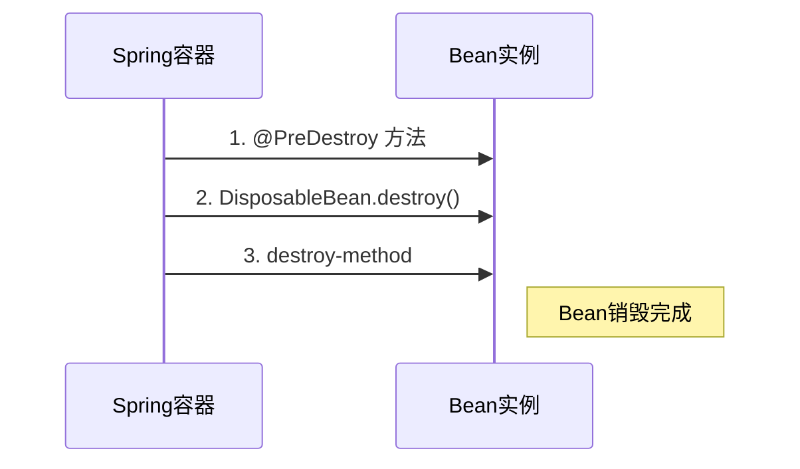
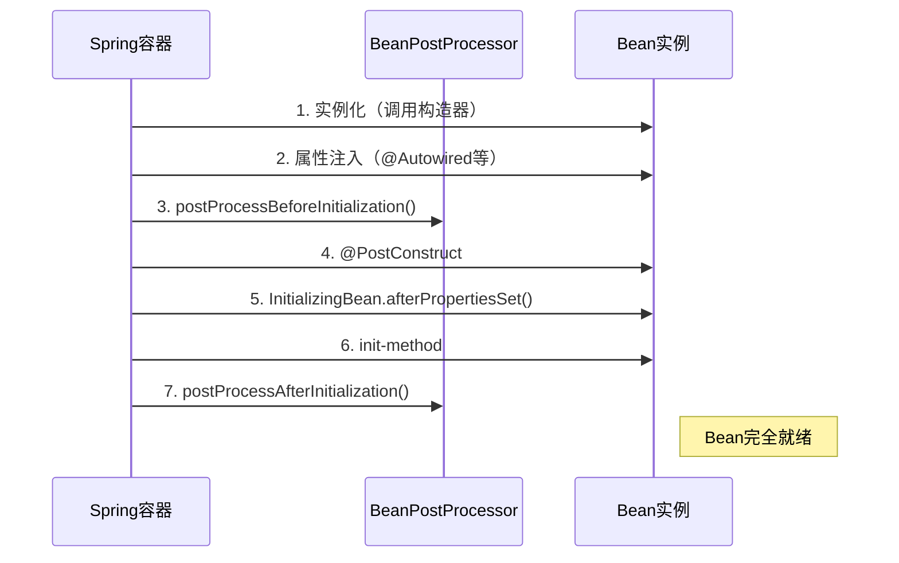
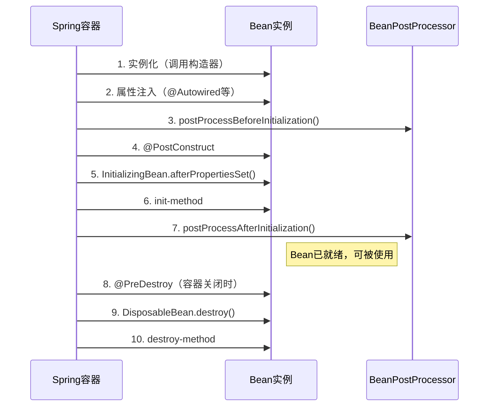

# **@Bean 中的 initMethod 和 destroyMethod 详解**

> `@Bean` 注解中的 `initMethod` 和 `destroyMethod` 是 Spring 提供的两种**生命周期回调机制**，用于指定 Bean 的初始化方法和销毁方法。它们与 `@PostConstruct` / `@PreDestroy` 类似，但更适用于**第三方库的 Bean** 或**无法修改源码的类**。

## 1. 基本用法

### 1.1 initMethod（初始化方法）

- **作用**：在 Bean 的属性注入完成后，容器会调用该方法。
- **适用场景**：初始化资源（如数据库连接、线程池）。

```java
@Configuration
public class AppConfig {
    @Bean(initMethod = "init")
    public MyService myService() {
        return new MyService();
    }
}

public class MyService {
    public void init() {
        System.out.println("初始化资源...");
    }
}
```

### 1.2 destroyMethod（销毁方法）

- **作用**：在容器关闭时调用，用于清理资源（如关闭连接、释放文件句柄）。
- **适用场景**：释放资源、优雅停机。

```java
@Configuration
public class AppConfig {
    @Bean(destroyMethod = "cleanup")
    public MyService myService() {
        return new MyService();
    }
}

public class MyService {
    public void cleanup() {
        System.out.println("释放资源...");
    }
}
```

## 2. 执行时机

### 2.1 初始化流程

1. 实例化 Bean（调用构造方法）。
2. 注入依赖（`@Autowired` / `@Resource`）。
3. 调用 `@PostConstruct` 方法（如果存在）。
4. 调用 `InitializingBean.afterPropertiesSet()`（如果实现该接口）。
5. **调用 `initMethod` 指定的方法**。

### 2.2 销毁流程

1. 容器关闭（如 `context.close()` 或应用退出）。
2. 调用 `@PreDestroy` 方法（如果存在）。
3. 调用 `DisposableBean.destroy()`（如果实现该接口）。
4. **调用 `destroyMethod` 指定的方法**。

## 3. 与其他生命周期回调的对比

| **回调方式**                              | **优点**             | **缺点**        | **执行顺序**   |
| ------------------------------------- | ------------------ | ------------- | ---------- |
| `@PostConstruct` / `@PreDestroy`      | 标准 JSR-250 注解，无侵入性 | 需修改源码         | 最早初始化，最晚销毁 |
| `InitializingBean` / `DisposableBean` | Spring 原生支持        | 耦合 Spring API | 中间顺序       |
| `initMethod` / `destroyMethod`        | 不修改源码，适合第三方库       | 需显式配置         | 最晚初始化，最早销毁 |

## 4. 特殊规则

### 4.1 默认的 destroyMethod

- 如果 Bean 实现了 `java.io.Closeable` 或 `java.lang.AutoCloseable`，Spring **默认会尝试调用其 `close()` 方法**（相当于隐式指定 `destroyMethod="close"`）。
- **禁用默认行为**：显式设置 `destroyMethod=""`。

  ```java
  @Bean(destroyMethod = "")  // 禁止自动调用 close()
  public DataSource dataSource() {
      return new HikariDataSource();
  }
  ```

### 4.2 方法签名要求

- `initMethod` 和 `destroyMethod` 必须满足以下条件：
  - 无参数。
  - 返回 `void`。
  - 可以是 `public`、`protected` 或包私有（但不能是 `private`）。

## 5. 实际应用示例

### 5.1 数据库连接池配置

```java
@Configuration
public class DataSourceConfig {
    @Bean(destroyMethod = "close")  // HikariCP 的 close() 方法
    public DataSource dataSource() {
        HikariConfig config = new HikariConfig();
        config.setJdbcUrl("jdbc:mysql://localhost:3306/test");
        config.setUsername("root");
        config.setPassword("123456");
        return new HikariDataSource(config);
    }
}
```

### 5.2 自定义线程池管理

```java
@Configuration
public class ThreadPoolConfig {
    @Bean(initMethod = "initialize", destroyMethod = "shutdown")
    public ExecutorService threadPool() {
        return Executors.newCachedThreadPool();
    }
}
```

## 6. 常见问题

### 6.1 方法找不到会报错吗？

- **initMethod**：如果指定的方法不存在，会抛出 `BeanCreationException`。
- **destroyMethod**：如果方法不存在，**静默忽略**（不会报错）。

### 6.2 能否同时使用多种初始化方式？

可以，执行顺序如下：

`@PostConstruct` → `InitializingBean` → `initMethod`。

### 6.3 原型（Prototype）Bean 的 destroyMethod 会生效吗？

不会。原型 Bean 的销毁方法需由调用方手动触发。

## 7. 最佳实践

1. **优先选择 `@PostConstruct` / `@PreDestroy`**：
   适合自己能控制的类，代码更简洁。
2. **第三方库用 `initMethod` / `destroyMethod`**：
   如数据库连接池、线程池等。
3. **避免重复配置**：
   如果类本身已实现 `InitializingBean` / `DisposableBean`，无需再指定 `initMethod` / `destroyMethod`。

## **总结**

| **场景**           | **推荐方式**                              |
| ---------------- | ------------------------------------- |
| 自定义 Bean 的初始化/销毁 | `@PostConstruct` + `@PreDestroy`      |
| 第三方库的 Bean 管理    | `initMethod` + `destroyMethod`        |
| 需要兼容旧代码          | `InitializingBean` + `DisposableBean` |

---

# `@PostConstruct` 和 `@PreDestroy` 详解

> `@PostConstruct` 和 `@PreDestroy` 是 **JSR-250（Java 标准规范）** 提供的两个注解，用于管理 Bean 的初始化和销毁逻辑。它们是 Spring 生命周期回调的**推荐方式**，具有以下特点：

## 1. 核心功能

| 注解              | 作用阶段               | 典型应用场景                     |
|-------------------|-----------------------|--------------------------------|
| `@PostConstruct`  | **Bean 初始化后**      | 数据加载、资源初始化、缓存预热     |
| `@PreDestroy`     | **Bean 销毁前**        | 资源释放、连接关闭、临时文件清理   |

## 2. 使用示例

**用法**

```java
import javax.annotation.PostConstruct;
import javax.annotation.PreDestroy;

@Component
public class DatabaseService {

    @PostConstruct
    public void init() {
        System.out.println("数据库连接初始化...");
        // 模拟初始化操作（如建立连接池）
    }

    @PreDestroy
    public void cleanup() {
        System.out.println("释放数据库连接...");
        // 模拟销毁操作（如关闭连接）
    }
}
```

**执行顺序**

```text
数据库连接初始化...  # 容器启动时调用
（应用运行中...）
释放数据库连接...    # 容器关闭时调用
```

## 3. 与其他生命周期回调的对比

| **回调方式**               | 优点                          | 缺点                          | 执行顺序（初始化） |
|---------------------------|------------------------------|------------------------------|------------------|
| `@PostConstruct`          | 标准注解，无侵入性            | 需修改源码                    | 最早             |
| `InitializingBean`        | Spring 原生支持               | 耦合 Spring API               | 中               |
| `initMethod`              | 不修改源码，适合第三方库       | 需显式配置                    | 最晚             |

**销毁顺序**：`@PreDestroy` → `DisposableBean.destroy()` → `destroyMethod`。

## 4. 技术细节

### 4.1 方法签名要求

- 方法必须为 `public void`，且无参数。
- 方法名任意（不强制叫 `init()` 或 `cleanup()`）。
- 不能是 `static` 或 `final`。

### 4.2 多方法调用

一个类中可以定义多个 `@PostConstruct` 方法，但**执行顺序不确定**（依赖反射 API 的返回顺序）。

**最佳实践**：每个 Bean 只定义一个初始化方法。

### 4.3 继承关系

- 父类的 `@PostConstruct` 方法会优先于子类执行。
- 如果子类重写了父类的 `@PostConstruct` 方法，**父类方法不会被自动调用**，需手动调用 `super.init()`。

## 5. 常见问题

### 5.1 注解不生效的可能原因

1. **未扫描到组件**：确保类被 `@ComponentScan` 扫描或显式配置为 `@Bean`。
2. **缺少依赖**：Jakarta EE 9+ 需引入 `jakarta.annotation-api`，旧版用 `javax.annotation-api`。

   ```xml
   <!-- Maven 依赖 -->
   <dependency>
       <groupId>jakarta.annotation</groupId>
       <artifactId>jakarta.annotation-api</artifactId>
       <version>2.1.1</version>
   </dependency>
   ```

3. **原型（Prototype）Bean 的 `@PreDestroy` 不生效**：Spring 不管理原型 Bean 的销毁。

### 5.2 与 AOP 代理的交互

如果 Bean 被 AOP 代理（如 `@Transactional`）：

- `@PostConstruct` 在代理对象创建后执行。
- `@PreDestroy` 在代理对象销毁前执行。

## 6. 实际应用场景

### 6.1 缓存预热

```java
@Service
public class CacheService {
    private Map<String, Object> cache;

    @PostConstruct
    public void loadCache() {
        this.cache = loadDataFromDatabase();  // 启动时加载数据到内存
    }
}
```

### 6.2 资源释放

```java
@Component
public class FileService {
    private File tempFile;

    @PostConstruct
    public void createTempFile() {
        this.tempFile = File.createTempFile("data", ".tmp");
    }

    @PreDestroy
    public void deleteTempFile() {
        if (tempFile != null) {
            tempFile.delete();  // 容器关闭时清理临时文件
        }
    }
}
```

## 7. 扩展：手动触发销毁

对于非单例 Bean（如原型作用域），需通过 `DisposableBeanAdapter` 手动触发销毁：

```java
@Autowired
private ConfigurableApplicationContext context;

public void destroyPrototypeBean() {
    // 获取原型 Bean 并手动销毁
    MyPrototypeBean bean = context.getBean(MyPrototypeBean.class);
    ((DisposableBean) bean).destroy();
}
```

## 总结

| **关键点**    | **说明**                        |
| ---------- | ----------------------------- |
| **标准化**    | 属于 JSR-250，非 Spring 特有        |
| **执行顺序**   | 初始化最早，销毁最晚                    |
| **适用场景**   | 资源管理、数据预加载、清理逻辑               |
| **对比其他回调** | 比 `InitializingBean` 更解耦      |
| **注意事项**   | 原型 Bean 的 `@PreDestroy` 需手动处理 |

**最佳实践**：
- 优先使用 `@PostConstruct` / `@PreDestroy`（而非 Spring 专用接口）。
- 避免在回调方法中执行耗时操作（影响启动速度）。
- 对于第三方库，结合 `initMethod` / `destroyMethod` 使用。

---

# InitializingBean 接口详解

> `InitializingBean` 是 Spring 提供的一个核心接口，用于**定义 Bean 初始化完成后的回调逻辑**。它是 Spring 生命周期管理的一部分，通常用于在 Bean 属性注入完成后执行自定义初始化操作。

## 1. 核心功能

- **作用时机**：在 Spring 完成 Bean 的依赖注入后，容器会自动调用 `afterPropertiesSet()` 方法。
- **典型用途**：
  - 数据校验（如检查必填属性是否注入）。
  - 资源初始化（如建立数据库连接、加载配置文件）。
  - 复杂对象的构造（需依赖其他 Bean 的场景）。

## 2. 基本用法

### 2.1 实现接口

```java
import org.springframework.beans.factory.InitializingBean;

@Component
public class MyService implements InitializingBean {
    private String apiKey;

    @Autowired
    public void setApiKey(@Value("${app.api.key}") String apiKey) {
        this.apiKey = apiKey;
    }

    @Override
    public void afterPropertiesSet() {
        if (apiKey == null) {
            throw new IllegalStateException("API Key 未配置！");
        }
        System.out.println("服务初始化完成，API Key: " + apiKey);
    }
}
```

### 2.2 执行顺序验证

当 Spring 容器启动时，控制台输出：

```text
服务初始化完成，API Key: abc123  # 在属性注入后自动调用
```

## 3. 与其他初始化方式的对比

| **初始化方式**          | 优点                          | 缺点                          | 执行顺序       |
|------------------------|------------------------------|------------------------------|---------------|
| `@PostConstruct`       | 标准注解，无侵入性            | 需修改源码                    | 最早          |
| `InitializingBean`     | Spring 原生支持               | 耦合 Spring API               | 中            |
| `initMethod`           | 不修改源码，适合第三方库       | 需显式配置                    | 最晚          |

**完整初始化流程**：
`@PostConstruct` → `InitializingBean.afterPropertiesSet()` → `initMethod`

## 4. 技术细节

### 4.1 方法签名要求

- `afterPropertiesSet()` 必须为 `public void`，无参数。
- 方法名固定（不可自定义）。

### 4.2 异常处理

- 如果 `afterPropertiesSet()` 抛出异常，Bean 初始化会失败，容器将抛出 `BeanCreationException`。

### 4.3 与 AOP 代理的交互

- 如果 Bean 被 AOP 代理（如 `@Transactional`），`afterPropertiesSet()` 会在代理对象创建后执行。

## 5. 实际应用场景

### 5.1 强制属性校验

```java
@Override
public void afterPropertiesSet() {
    if (this.dataSource == null) {
        throw new BeanInitializationException("DataSource 必须注入！");
    }
}
```

### 5.2 复杂资源初始化

```java
private JedisConnection redisConnection;

@Override
public void afterPropertiesSet() throws Exception {
    this.redisConnection = new JedisConnection("redis://localhost:6379");
    this.redisConnection.connect();
}
```

## 6. 常见问题

### 6.1 为什么推荐使用 `@PostConstruct` 替代？

- **解耦**：`@PostConstruct` 是 Java 标准（JSR-250），不依赖 Spring 接口。
- **灵活性**：方法名可自定义，而 `afterPropertiesSet()` 是固定名称。

### 6.2 能否与 `@PostConstruct` 共存？

可以，执行顺序为：

1. `@PostConstruct` 方法
2. `afterPropertiesSet()`
3. `initMethod`

```java
@Component
public class MyBean implements InitializingBean {
    @PostConstruct
    public void postConstruct() {
        System.out.println("@PostConstruct");
    }

    @Override
    public void afterPropertiesSet() {
        System.out.println("InitializingBean");
    }
}
```

输出：

```text
@PostConstruct
InitializingBean
```

### 6.3 原型（Prototype）Bean 的初始化

- 原型 Bean 的 `afterPropertiesSet()` 每次创建新实例时都会调用。

## 7. 源码分析

在 Spring 的初始化流程中，`afterPropertiesSet()` 通过 `AbstractAutowireCapableBeanFactory` 调用：

```java
// 源码片段（Spring 5.3+）
if (bean instanceof InitializingBean) {
    ((InitializingBean) bean).afterPropertiesSet();
}
```

## 总结

| **关键点**                 | **说明**                              |
|---------------------------|--------------------------------------|
| **接口定义**              | 需实现 `afterPropertiesSet()` 方法     |
| **执行时机**              | 属性注入完成后，`initMethod` 之前      |
| **适用场景**              | 强依赖 Spring 的组件                   |
| **对比 `@PostConstruct`** | 更耦合，但适合需要严格属性校验的场景    |
| **最佳实践**              | 优先用 `@PostConstruct`，复杂场景用接口 |

**使用建议**：
- 如果是 Spring 专用组件，且需要严格初始化控制，可用 `InitializingBean`。
- 其他场景优先选择 `@PostConstruct` + `initMethod`。

---

# DisposableBean 接口详解

> `DisposableBean` 是 Spring 框架提供的一个核心接口，用于**管理 Bean 销毁时的资源清理**。它定义了标准的 Bean 销毁回调机制，是 Spring 生命周期的重要组成部分。

## 1. 核心作用

- **资源释放**：在容器关闭时执行清理操作（如关闭数据库连接、释放文件句柄）
- **优雅停机**：确保应用退出时资源被正确释放
- **标准化回调**：提供统一的销毁接口

## 2. 接口定义

```java
public interface DisposableBean {
    void destroy() throws Exception;
}
```

## 3. 执行时机



 **完整销毁顺序**：

`@PreDestroy` → `DisposableBean.destroy()` → `destroy-method`

## 4. 基本用法

```java
@Component
public class DatabaseConnection implements DisposableBean {
    private Connection conn;
    
    public DatabaseConnection() {
        this.conn = DriverManager.getConnection("jdbc:mysql://localhost:3306/mydb");
    }

    @Override
    public void destroy() throws Exception {
        if (conn != null && !conn.isClosed()) {
            System.out.println("关闭数据库连接...");
            conn.close(); // 资源释放
        }
    }
}
```

## 5. 与其他销毁方式的对比

| **销毁方式**         | 优点                          | 缺点                          | 执行顺序 |
|----------------------|------------------------------|------------------------------|---------|
| `@PreDestroy`        | 标准注解，无侵入性            | 需修改源码                    | 最早     |
| `DisposableBean`     | Spring 原生支持               | 耦合 Spring API               | 中       |
| `destroy-method`     | 不修改源码，适合第三方库       | 需显式配置                    | 最晚     |

## 6. 技术细节

### 6.1 方法签名要求

- 必须为 `public void`
- 可以抛出异常（Spring 会记录但不中断销毁流程）

### 6.2 原型 (Prototype) Bean 的特殊性

- Spring **不会管理**原型 Bean 的销毁
- 需要手动调用销毁方法：

  ```java
  context.getBeanFactory().destroyBean(prototypeBean);
  ```

### 6.3 与 AOP 代理的交互

- 如果 Bean 被代理，`destroy()` 会在代理对象销毁前执行

## 7. 实际应用场景

### 7.1 文件资源清理

```java
public class FileService implements DisposableBean {
    private List<File> tempFiles = new ArrayList<>();

    @Override
    public void destroy() {
        tempFiles.forEach(file -> {
            if (file.exists()) file.delete();
        });
    }
}
```

### 7.2 线程池关闭

```java
public class TaskExecutor implements DisposableBean {
    private ExecutorService executor = Executors.newFixedThreadPool(5);

    @Override
    public void destroy() {
        executor.shutdownNow();
        System.out.println("线程池已关闭");
    }
}
```

## 8. 最佳实践

1. **优先使用 `@PreDestroy`**
   更符合解耦原则，除非需要兼容旧版 Spring

2. **重要资源双保险**
   同时实现 `DisposableBean` 和 `@PreDestroy`：

   ```java
   @Component
   public class CriticalResource implements DisposableBean {
       @PreDestroy
       public void preDestroy() {
           System.out.println("第一道清理");
       }
       
       @Override
       public void destroy() {
           System.out.println("第二道清理");
       }
   }
   ```

3. **避免耗时操作**
   销毁方法应快速执行，否则可能影响容器关闭

## 9. 源码分析

销毁流程通过 `DisposableBeanAdapter` 实现：

```java
// 简化版源码逻辑
if (bean instanceof DisposableBean) {
    ((DisposableBean) bean).destroy();
}
```

## 10. 常见问题

### Q 1: 销毁方法没被调用？

- 确保是单例 Bean（原型 Bean 不自动销毁）
- 检查是否调用了 `context.close()`

### Q 2: 与 finalize () 的区别？

|                | `DisposableBean`             | `finalize()`                  |
|----------------|-----------------------------|------------------------------|
| 调用时机       | 确定性的容器关闭时           | GC 不确定回收时               |
| 可靠性         | 100% 执行                   | 不保证一定执行                |
| 适用场景       | 关键资源释放                | 最后防线（不推荐依赖）        |

### Q 3: 如何手动触发销毁？

```java
ConfigurableApplicationContext ctx = ...;
ctx.getBeanFactory().destroySingleton("beanName");
```

## 总结

| **关键点**         | **说明**                              |
|--------------------|--------------------------------------|
| 接口方法           | `destroy()`                          |
| 执行顺序           | 在 `@PreDestroy` 之后，`destroy-method` 之前 |
| 适用场景           | 需要强保证的资源清理                  |
| 与 Spring 耦合度   | 高（实现 Spring 接口）                |
| 替代方案           | `@PreDestroy`（推荐）                |

**使用建议**：
- 新项目优先使用 `@PreDestroy`
- 需要与旧 Spring 版本兼容时使用 `DisposableBean`
- 重要资源建议实现双重清理机制

---

# BeanPostProcessor 接口详解

> `BeanPostProcessor` 是 Spring 框架中**最强大的扩展接口之一**，它允许开发者在 **Bean 初始化前后** 对 Bean 实例进行拦截和自定义处理。这是 Spring AOP、自动代理等核心功能的底层基础。

## 1. 核心作用

- **干预 Bean 的创建过程**：在 Bean 初始化前后插入自定义逻辑
- **修改或包装 Bean 实例**：例如生成代理对象、属性增强等
- **全局性影响**：对所有 Bean 生效（可针对性过滤）

## 2. 接口定义

```java
public interface BeanPostProcessor {
    // 初始化前回调
    default Object postProcessBeforeInitialization(Object bean, String beanName) {
        return bean;
    }
    
    // 初始化后回调
    default Object postProcessAfterInitialization(Object bean, String beanName) {
        return bean;
    }
}
```

## **3. 执行时机**



## 4. 典型应用场景

### 4.1 自定义注解处理

```java
public class CustomAnnotationProcessor implements BeanPostProcessor {
    @Override
    public Object postProcessBeforeInitialization(Object bean, String beanName) {
        if (bean.getClass().isAnnotationPresent(CustomLog.class)) {
            System.out.println("发现带有@CustomLog的Bean: " + beanName);
        }
        return bean;
    }
}
```

### 4.2 AOP 自动代理（Spring AOP 实现原理）

```java
public class DebugBeanPostProcessor implements BeanPostProcessor {
    @Override
    public Object postProcessAfterInitialization(Object bean, String beanName) {
        if (bean instanceof UserService) { // 只代理特定Bean
            return Proxy.newProxyInstance(
                bean.getClass().getClassLoader(),
                bean.getClass().getInterfaces(),
                (proxy, method, args) -> {
                    System.out.println("方法拦截: " + method.getName());
                    return method.invoke(bean, args);
                });
        }
        return bean;
    }
}
```

### 4.3 性能监控

```java
public class TimingBeanPostProcessor implements BeanPostProcessor {
    @Override
    public Object postProcessAfterInitialization(Object bean, String beanName) {
        if (bean instanceof Controller) {
            return new TimingProxy(bean); // 包装原始Bean
        }
        return bean;
    }
}
```

## 5. 高级特性

### 5.1 执行顺序控制

- 实现 `Ordered` 接口或使用 `@Order` 注解

```java
@Component
@Order(Ordered.HIGHEST_PRECEDENCE) // 最高优先级
public class HighPriorityProcessor implements BeanPostProcessor {}
```

### 5.2 针对特定 Bean 处理

```java
@Override
public Object postProcessBeforeInitialization(Object bean, String beanName) {
    if (bean instanceof SpecialType) {
        // 只处理特定类型的Bean
    }
    return bean;
}
```

### 5.3 与 BeanFactory 交互

```java
@Component
public class AdvancedProcessor implements BeanPostProcessor, BeanFactoryAware {
    private ConfigurableListableBeanFactory beanFactory;

    @Override
    public void setBeanFactory(BeanFactory beanFactory) {
        this.beanFactory = (ConfigurableListableBeanFactory) beanFactory;
    }

    @Override
    public Object postProcessAfterInitialization(Object bean, String beanName) {
        // 可以使用beanFactory进行复杂操作
        return bean;
    }
}
```

## 6. 与相关接口对比

| 接口/注解               | 作用范围         | 执行顺序       | 典型用途                     |
|------------------------|----------------|---------------|----------------------------|
| `BeanPostProcessor`    | 全局           | 最早/最晚      | AOP、监控、扩展处理           |
| `@PostConstruct`       | 单个 Bean       | 初始化阶段早期  | 简单初始化逻辑                |
| `InitializingBean`     | 单个 Bean       | 初始化阶段中期  | 复杂初始化                    |
| `init-method`          | 单个 Bean       | 初始化阶段晚期  | 第三方库集成                  |

## 7. 实现注意事项

 **避免在处理器中创建新 Bean**：

   ```java
   // 错误示范！会导致循环依赖
   @Override
   public Object postProcessBeforeInitialization(Object bean, String beanName) {
       beanFactory.getBean(OtherService.class); // 危险！
       return bean;
   }
   ```

**性能优化**：

   ```java
   private final Map<String, Boolean> cache = new ConcurrentHashMap<>();
   
   @Override
   public Object postProcessBeforeInitialization(Object bean, String beanName) {
       if (cache.computeIfAbsent(beanName, k -> 
           bean.getClass().isAnnotationPresent(Special.class))) {
           // 处理逻辑
       }
       return bean;
   }
   ```

**原型 Bean 的特殊处理**：

   ```java
   @Override
   public Object postProcessAfterInitialization(Object bean, String beanName) {
       if (beanFactory.getBeanDefinition(beanName).isPrototype()) {
           // 对原型Bean的特殊处理
       }
       return bean;
   }
   ```

## 8. 最佳实践

1. **命名规范**：
   - 处理器类名以 `BeanPostProcessor` 结尾
   - 例如：`LoggingBeanPostProcessor`

2. **作用域控制**：

   ```java
   @Component
   @Scope(ConfigurableBeanFactory.SCOPE_PROTOTYPE) // 每个处理器都是新实例
   public class PrototypeProcessor implements BeanPostProcessor {}
   ```

3. **组合使用**：

   ```java
   public class CompositeProcessor implements BeanPostProcessor, PriorityOrdered {
       // 实现多个接口
   }
   ```

## 10. 常见问题解答

**Q 1: 为什么我的 BeanPostProcessor 不生效？**
- 确保处理器类被组件扫描到
- 检查是否被其他更高优先级的处理器覆盖

**Q 2: 如何处理循环依赖？**
- 避免在处理器中获取其他 Bean
- 使用 `@Lazy` 延迟注入

**Q 3: 如何只处理特定包下的 Bean？**

```java
@Override
public Object postProcessBeforeInitialization(Object bean, String beanName) {
    if (bean.getClass().getPackage().getName().startsWith("com.myapp")) {
        // 处理逻辑
    }
    return bean;
}
```

## **总结**

`BeanPostProcessor` 是 Spring 框架中**最强大的扩展机制**之一，掌握它可以实现：

- 深度定制 Bean 的创建过程
- 实现类似 AOP 的功能
- 构建各种高级特性（如自动装配、校验等）

**关键点记忆表**：

| 特性                | 说明                          |
|---------------------|-----------------------------|
| 双向拦截            | 初始化前后都可干预             |
| 全局作用            | 影响容器中所有 Bean            |
| 执行顺序可控        | 通过 `Ordered` 接口调整        |
| 修改 Bean 实例      | 可以返回包装后的对象            |
| Spring 核心基础     | AOP、事务等都依赖此机制         |

---

# Spring 组件生命周期详解

> Spring 组件的生命周期指的是 **Bean 从创建到销毁的完整过程**，Spring 提供了多种扩展点（回调接口和注解）让开发者可以干预这一过程。理解生命周期对编写高效、稳定的 Spring 应用至关重要。

## 1. Spring Bean 生命周期的主要阶段 (单例 Bean)

### 1.1 实例化（Instantiation）

   - 通过构造器或工厂方法创建 Bean 实例。
   - 如果是代理对象（如 AOP），则先创建原始对象再包装。

### 1.2 属性赋值（Population）

   - 注入依赖（通过 `@Autowired`、`@Resource` 或 XML 配置）。

### 1.3 初始化前（Pre-Initialization）

   1. 调用 `BeanPostProcessor.postProcessBeforeInitialization()`。
   2. 执行 `@PostConstruct` 注解的方法。

### 1.4 初始化（Initialization）

   1. 调用 `InitializingBean.afterPropertiesSet()`。
   2. 执行自定义的 `init-method`

### 1.5 初始化后（Post-Initialization）

   - 调用 `BeanPostProcessor.postProcessAfterInitialization()`。
   - 此时 Bean 已完全就绪，可被其他组件使用。

### 1.6 销毁前（Pre-Destruction）

   1. 容器关闭时，调用 `@PreDestroy` 注解的方法。
   2. 执行 `DisposableBean.destroy()`。
   3. 调用自定义的 `destroy-method`（通过 `@Bean(destroyMethod="cleanup")` 或 XML 配置）。

## 2. 生命周期扩展点详解

### 2.1 初始化扩展点

| 扩展方式                | 说明                                                                 | 执行顺序 |
|-------------------------|---------------------------------------------------------------------|----------|
| `@PostConstruct`        | JSR-250 标准注解，标记初始化方法。                                   | 1        |
| `InitializingBean`      | Spring 接口，需实现 `afterPropertiesSet()` 方法。                   | 2        |
| `init-method`           | 通过 `@Bean` 或 XML 指定的自定义初始化方法。                         | 3        |

**示例代码：**

```java
@Component
public class MyBean implements InitializingBean {
    @PostConstruct
    public void postConstruct() {
        System.out.println("@PostConstruct");
    }

    @Override
    public void afterPropertiesSet() {
        System.out.println("InitializingBean.afterPropertiesSet()");
    }

    public void init() {
        System.out.println("init-method");
    }
}
```

### 2.2 销毁扩展点

| 扩展方式             | 说明                            | 执行顺序 |
| ---------------- | ----------------------------- | ---- |
| `@PreDestroy`    | JSR-250 标准注解，标记销毁前调用的方法。      | 1    |
| `DisposableBean` | Spring 接口，需实现 `destroy()` 方法。 | 2    |
| `destroy-method` | 通过 `@Bean` 或 XML 指定的自定义销毁方法。  | 3    |

**示例代码：**

```java
@Component
public class MyBean implements DisposableBean {
    @PreDestroy
    public void preDestroy() {
        System.out.println("@PreDestroy");
    }

    @Override
    public void destroy() {
        System.out.println("DisposableBean.destroy()");
    }

    public void cleanup() {
        System.out.println("destroy-method");
    }
}
```

### 2.3 全局拦截点

- **作用**：`BeanPostProcessor` 对所有 Bean 的初始化过程进行拦截和增强。
- **方法**：
  - `postProcessBeforeInitialization()`：在初始化前调用。
  - `postProcessAfterInitialization()`：在初始化后调用。

**示例：实现一个简单的日志打印处理器**

```java
@Component
public class LogBeanPostProcessor implements BeanPostProcessor {
    @Override
    public Object postProcessBeforeInitialization(Object bean, String beanName) {
        System.out.println("Before init: " + beanName);
        return bean;
    }

    @Override
    public Object postProcessAfterInitialization(Object bean, String beanName) {
        System.out.println("After init: " + beanName);
        return bean;
    }
}
```

## 3. 原型（Prototype）Bean 的生命周期

- **不同点**：原型 Bean 的生命周期**不包含销毁阶段**，Spring 不会管理它的销毁。
- **流程**：
  1. 实例化 → 2. 属性赋值 → 3. 初始化 → 4. 交给调用方（容器不再跟踪）。

## 4. 生命周期流程图



## 5. 常见问题

### 5.1 如何控制多个 `BeanPostProcessor` 的执行顺序？

- 实现 `Ordered` 接口或使用 `@Order` 注解：

  ```java
  @Component
  @Order(1)  // 数字越小优先级越高
  public class CustomProcessor implements BeanPostProcessor {}
  ```

### 5.2 为什么原型 Bean 的 `@PreDestroy` 不生效？

- Spring 不管理原型 Bean 的销毁，需手动调用销毁方法（或使用 `ObjectProvider`）。

### 5.3 生命周期回调与 AOP 代理的关系？

- 如果 Bean 被 AOP 代理，回调方法（如 `@PostConstruct`）会在代理对象生成后执行。

## 6. 最佳实践

1. **优先使用注解**：`@PostConstruct` 和 `@PreDestroy` 是 JSR 标准，更通用。
2. **避免接口污染**：尽量不用 `InitializingBean` 和 `DisposableBean`（耦合 Spring API）。
3. **复杂逻辑用 `BeanPostProcessor`**：例如统一监控 Bean 的初始化耗时。
4. **原型 Bean 需手动清理**：如数据库连接等资源，显式调用关闭方法。
