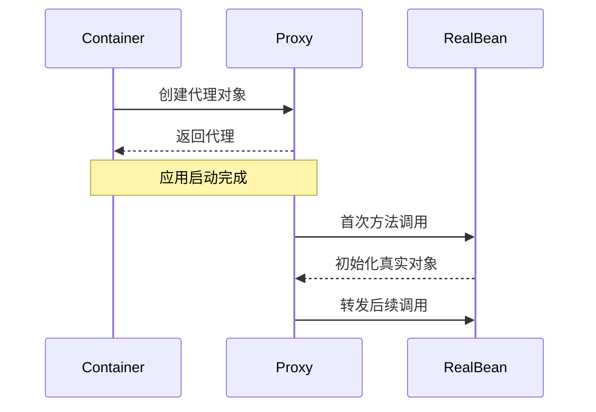

# 一、Spring 核心

## Spring 框架的核心优点

1. **轻量级与非侵入式**
   - Spring 的组件（如 Bean）是普通的 POJO（Plain Old Java Object），不强制依赖 Spring 的接口或类，代码干净且易于复用。
2. **控制反转（IoC）与依赖注入（DI）**

   - **IoC 容器** 自动管理对象的生命周期和依赖关系，开发者通过配置（XML/注解/Java Config）声明依赖，Spring 自动装配。
   - 示例：通过 `@Autowired` 注解注入服务，避免硬编码 `new` 对象。

3. **面向切面编程（AOP）**

   - 将横切关注点（如日志、事务、安全）与业务逻辑分离，通过切面（Aspect）动态增强功能，减少重复代码。

4. **模块化设计**

   - Spring 由多个独立模块组成（如 Core、MVC、Data、Security 等），可按需引入，避免臃肿。

5. **强大的集成能力**

   - 无缝整合主流技术（如 Hibernate、MyBatis、JPA、Redis、Kafka），提供模板类（如 `JdbcTemplate`）简化操作。

6. **声明式事务管理**

   - 通过 `@Transactional` 注解即可实现事务，无需手动编写提交/回滚代码，支持多种传播行为。

7. **Spring Boot 的加持**

   - **快速开发**：自动配置、内嵌服务器（Tomcat）、Starter 依赖一键引入。
   - **约定优于配置**：减少 XML 配置，开箱即用。

8. **测试友好**

   - 提供 `Spring Test` 模块，支持单元测试与集成测试（如 `@SpringBootTest`），Mock 工具完善。

9. **活跃的生态与社区**
   - Spring 家族涵盖 Cloud、Security、Batch 等解决方案，社区资源丰富，问题易解决。

---

## Spring 容器与组件的核心概念

### 1. Spring 容器（Container）

> Spring 容器是 Spring 框架的核心，负责管理应用中所有组件的生命周期、依赖关系及配置。它通过 **控制反转（IoC）** 机制，将对象的创建和依赖注入交给容器处理，开发者只需关注业务逻辑。

#### 1.1 容器的类型

- **BeanFactory**
  - 基础容器，提供最基本的 DI 支持（懒加载）。
  - 通过 `XmlBeanFactory` 读取 XML 配置（已过时，不推荐）。
- **ApplicationContext**
  - `BeanFactory` 的子接口，功能更丰富（推荐使用）。
  - 支持事件发布、国际化、资源加载等。
  - 常见实现类：
    - `ClassPathXmlApplicationContext`（XML 配置）
    - `AnnotationConfigApplicationContext`（注解配置）
    - `FileSystemXmlApplicationContext`（文件系统路径加载 XML）

#### 1.2 容器的作用

- 实例化、配置和组装 Bean。
- 解决 Bean 之间的依赖关系（依赖注入）。
- 管理 Bean 的生命周期（初始化、销毁）。

### 2. Spring 组件（Bean）

> 在 Spring 中，**组件（Component）** 是指由容器管理的对象，统称为 **Bean**。Bean 可以是 Service、DAO、Controller 等任何需要被 Spring 管理的类。

#### 2.1 Bean 的定义方式

- **XML 配置**（传统方式）

  ```xml
  <bean id="userService" class="com.example.UserService">
      <property name="userDao" ref="userDao" />
  </bean>
  ```

- **注解配置**（现代主流方式）
  - `@Component`：通用组件标记。
  - 衍生注解：
    - `@Service`（业务层）
    - `@Repository`（数据层）
    - `@Controller` / `@RestController`（Web 层）

  ```java
  @Service
  public class UserService {
      @Autowired
      private UserDao userDao;
  }
  ```

- **Java Config**（基于代码的配置）

  ```java
  @Configuration
  public class AppConfig {
      @Bean
      public UserService userService() {
          return new UserService(userDao());
      }
  }
  ```

#### 2.2 Bean 的核心特性

- **作用域（Scope）**：
  - `singleton`（默认，单例）
  - `prototype`（每次请求新实例）
  - `request` / `session`（Web 环境）

  ```java
  @Scope("prototype")
  @Component
  public class TaskProcessor {}
  ```

- **生命周期回调**：
  - `@PostConstruct`：初始化后执行。
  - `@PreDestroy`：销毁前执行。

  ```java
  @Component
  public class DatabaseConnector {
      @PostConstruct
      public void init() { System.out.println("连接数据库..."); }

      @PreDestroy
      public void cleanup() { System.out.println("释放资源..."); }
  }
  ```

- **依赖注入（DI）方式**：
  - **字段注入**（`@Autowired` 直接标注字段，简洁但不易测试）。
  - **构造器注入**（推荐，显式声明依赖，避免循环依赖）。
  - **Setter 注入**（灵活性高，适合可选依赖）。

  ```java
  @Service
  public class OrderService {
      private final PaymentService paymentService;

      // 构造器注入（Spring 4.3+ 可省略 @Autowired）
      public OrderService(PaymentService paymentService) {
          this.paymentService = paymentService;
      }
  }
  ```

### 3. 容器与组件的协作流程

**(1) 启动容器**：

- 读取配置（XML/注解/Java Config）。
- 扫描指定路径下的 `@Component` 类。

**(2) 创建 Bean**：

- 根据作用域实例化 Bean。
- 解析依赖并注入（如 `@Autowired`）。

**(3) 生命周期管理**：

- 调用初始化方法（`@PostConstruct`）。
- 运行期间通过容器获取 Bean（如 `applicationContext.getBean()`）。

**(4) 销毁容器**：

- 调用销毁方法（`@PreDestroy`）。

### 4. 示例

```java
// 1. 定义组件
@Service
public class UserService {
    @Autowired
    private UserRepository userRepository;

    public String getUserName(Long id) {
        return userRepository.findNameById(id);
    }
}

// 2. 配置容器（注解方式）
@Configuration
@ComponentScan("com.example")
public class AppConfig {}

// 3. 启动容器
public class Main {
    public static void main(String[] args) {
        ApplicationContext context =
            new AnnotationConfigApplicationContext(AppConfig.class);
        UserService userService = context.getBean(UserService.class);
        System.out.println(userService.getUserName(1L));
    }
}
```

### 总结

- **容器**：是 Spring 的“大脑”，负责管理所有 Bean。
- **Bean**：是 Spring 管理的基本单元，通过 DI 实现松耦合。
- **推荐实践**：优先使用注解（如 `@Service` + `@Autowired`）和构造器注入。

---

## 控制反转与依赖注入详解

### 1. 控制反转（Inversion of Control, IoC）

#### 1.1 核心思想

- **传统编程**：对象的创建、依赖管理由开发者手动控制（通过 `new` 关键字）。

  ```java
  // 传统方式：主动创建依赖
  class UserService {
      private UserDao userDao = new UserDao(); // 硬编码依赖
  }
  ```

- **IoC 模式**：将控制权交给框架/容器，由容器负责对象的生命周期和依赖关系。

  ```java
  // IoC 方式：容器注入依赖
  class UserService {
      private UserDao userDao; // 依赖由容器提供
  }
  ```

#### 1.2 IoC 的实现方式

- **依赖查找（Dependency Lookup）**：主动从容器中获取依赖（如 `context.getBean()`），已较少使用。
- **依赖注入（Dependency Injection, DI）**：容器自动装配依赖（主流方式）。

### 2. 依赖注入（Dependency Injection, DI）

#### 2.1 核心思想

由容器在运行时动态地将依赖对象注入到目标组件中，而非由组件自己创建依赖。

#### 2.2 三种注入方式

- **构造器注入（推荐）**
  - 通过构造方法注入，依赖不可变（`final`），避免空指针。

  ```java
  @Service
  public class OrderService {
      private final PaymentService paymentService;

      // Spring 4.3+ 可省略 @Autowired
      public OrderService(PaymentService paymentService) {
          this.paymentService = paymentService;
      }
  }
  ```

- **Setter 注入**
  - 通过 Setter 方法注入，适合可选依赖。

  ```java
  @Service
  public class NotificationService {
      private EmailService emailService;

      @Autowired
      public void setEmailService(EmailService emailService) {
          this.emailService = emailService;
      }
  }
  ```

- **字段注入（不推荐）**
  - 直接通过 `@Autowired` 注入字段，代码简洁但难以测试。

  ```java
  @Service
  public class UserService {
      @Autowired
      private UserRepository userRepository; // 不易单元测试
  }
  ```

### 3. IoC 与 DI 的关系

- **IoC 是设计原则**：强调“控制权反转”，将对象创建和依赖管理的责任从开发者转移给容器。
- **DI 是实现方式**：是 IoC 的具体技术手段，通过注入依赖实现控制反转。

### 4. IoC/DI 的优点

- **解耦**：组件不直接依赖具体实现，而是依赖接口。
- **可测试性**：易于 Mock 依赖（如单元测试中注入模拟对象）。
- **灵活性**：通过配置切换依赖的实现（如切换数据库驱动）。

### 总结

- **IoC**：将控制权从开发者转移到容器。
- **DI**：通过构造函数、Setter 或字段注入依赖。
- **Spring 容器**：负责管理 Bean 的生命周期和依赖关系。

---

## 通过 getBean 获取组件对象

### 1. 开启一个 spring 应用上下文环境

```java
ConfigurableApplicationContext ioc = SpringApplication.run(SpringIocApplication.class, args);
```

- ApplicationContext：Spring 应用上下文对象，即 IOC 容器

### 2. 注册组件

```java
@Bean
public Person person() {
    Person person = new Person();
    person.setName("ren");
    person.setAge(18);
    person.setAddress("mas");

    return person;
}
```

### 3. 获取容器组件的名字

```java
String[] names = ioc.getBeanDefinitionNames();
for (String name : names) {
	System.out.println("name = " + name);
}
```

- Ioc 容器中自带很多组件

### 4. 从 ioc 中精确获取组件对象

```java
// 通过名字获取组件对象
Person person1 = (Person)ioc.getBean("person");

// 通过类型获取组件对象
Person person2 = ioc.getBean(Person.class);

// 通过名字和类型获取组件对象
Person person3 = ioc.getBean("person", Person.class);

// 通过类型获取组件对象集合
Map<String, Dog> type = ioc.getBeansOfType(Dog.class);
```

- **组件名字应该全局唯一**，如果重复，则会返回最先声明的那个

### 注意

**获取组件的各种情况**

- 组件不存在，抛出异常
- 组件不唯一
  - 按照名字获取，组件名字相同，则返回最先声明的那个
  - 按照类型获取，组件类型相同，抛出异常
  - 可正常通过 List 集合获取
- 组件唯一，则返回该对象

**组件对象创建的特征**

- **单实例**：重复获取组件时，返回的都是同一个对象
- **创建时机**：容器创建过程中组件对象完成实例化，并非在获取的时候实例化

---

## @Configuration 注解详解

> `@Configuration` 是 Spring 框架中用于定义 **配置类** 的核心注解，标记在类上，表示该类是一个 Spring 配置类，用于替代传统的 XML 配置文件。它通常与 `@Bean` 注解配合使用，声明 Spring 容器需要管理的 Bean。

### 1. 基本作用

#### 1.1 替代 XML 配置

- **传统 XML 配置**：

  ```xml
  <beans>
      <bean id="userService" class="com.example.UserService"/>
      <bean id="userRepository" class="com.example.UserRepository"/>
  </beans>
  ```

- **使用 `@Configuration` 的 Java 配置**：

  ```java
  @Configuration
  public class AppConfig {
      @Bean
      public UserService userService() {
          return new UserService();
      }

      @Bean
      public UserRepository userRepository() {
          return new UserRepository();
      }
  }
  ```

#### 1.2 声明 Spring 组件

`@Configuration` 本身也是一个 `@Component`，因此：

- 配置类本身会被 Spring 容器管理。
- 可以注入其他 Bean（如 `@Autowired`）。

### 2. 配置类的优点

- 类型安全（编译时检查）。
- 支持 IDE 自动补全和重构。
- 更灵活的编程式配置。

### 3. 核心特性

#### 3.1 注册 Bean

`@Configuration` 类中的 `@Bean` 方法用于注册 Bean：

```java
@Configuration
public class DatabaseConfig {
    @Bean
    public DataSource dataSource() {
        return new HikariDataSource();
    }

    @Bean
    public JdbcTemplate jdbcTemplate(DataSource dataSource) {
        return new JdbcTemplate(dataSource); // 自动注入 dataSource
    }
}
```

**特点**：

- 方法名默认作为 Bean 名称（可通过 `@Bean(name = "myBean")` 自定义）。
- 支持依赖注入（方法参数自动匹配容器中的 Bean）。

#### 3.2 代理模式（CGLIB 增强）

`@Configuration` 类在运行时会被 Spring **动态代理**（CGLIB），确保：

- `@Bean` 方法调用返回的是 **单例 Bean**（避免重复创建）。
- 解决跨 `@Bean` 方法引用时的依赖问题。

**示例**：

```java
@Configuration
public class AppConfig {
    @Bean
    public A a() {
        return new A(b()); // 调用 b() 方法，返回的是 Spring 代理的 Bean
    }

    @Bean
    public B b() {
        return new B();
    }
}
```

**关键点**：

- 如果去掉 `@Configuration`，`a()` 直接调用 `b()` 会创建新的 `B` 实例（非单例）。
- 使用 `@Configuration` 后，Spring 会确保 `b()` 返回的是容器管理的单例。

### 4. 与其他注解的配合

#### 4.1 `@ComponentScan`

在 `@Configuration` 类上添加 `@ComponentScan`，自动扫描指定包下的 `@Component`、`@Service` 等注解的类：

```java
@Configuration
@ComponentScan("com.example") // 扫描 com.example 包及其子包
public class AppConfig {}
```

**等效于 XML 配置**：

```xml
<context:component-scan base-package="com.example"/>
```

#### 4.2 `@Import`

引入其他配置类，实现模块化配置：

```java
@Configuration
@Import({DatabaseConfig.class, SecurityConfig.class})
public class AppConfig {}
```

#### 4.3 `@PropertySource`

加载外部配置文件（如 `application.properties`）：

```java
@Configuration
@PropertySource("classpath:application.properties")
public class AppConfig {
    @Value("${db.url}")
    private String dbUrl;

    @Bean
    public DataSource dataSource() {
        return new HikariDataSource(dbUrl);
    }
}
```

#### 4.4 `@Conditional`

结合 `@Conditional` 实现条件化配置，动态注册 Bean：

```java
@Configuration
public class CacheConfig {
    @Bean
    @ConditionalOnProperty(name = "cache.enabled", havingValue = "true")
    public CacheManager cacheManager() {
        return new RedisCacheManager();
    }
}
```

#### 4.5 `@Profile`

使用 `@Profile` 区分不同环境的 Bean：

```java
@Configuration
public class EnvConfig {
    @Bean
    @Profile("dev")
    public DataSource devDataSource() {
        return new EmbeddedDatabaseBuilder().setType(H2).build();
    }

    @Bean
    @Profile("prod")
    public DataSource prodDataSource() {
        return new HikariDataSource(/*生产环境配置*/);
    }
}
```

### 5. 注意事项

#### **5.1 避免循环依赖**

如果两个 `@Bean` 方法相互依赖，需使用 `@Lazy` 延迟初始化：

```java
@Configuration
public class AppConfig {
    @Bean
    public A a(@Lazy B b) { return new A(b); }

    @Bean
    public B b(A a) { return new B(a); } // 会报错，除非 A 或 B 使用 @Lazy
}
```

#### **5.2 `@Configuration` vs `@Component`**

| **特性**     | **`@Configuration`**     | **`@Component`**              |
| ------------ | ------------------------ | ----------------------------- |
| **用途**     | 定义配置类，声明 `@Bean` | 通用组件标记（如 `@Service`） |
| **代理行为** | 是（CGLIB 增强）         | 否                            |
| **方法调用** | 确保单例（通过代理）     | 直接调用，无特殊处理          |

#### **5.3 性能优化**

- `@Configuration` 类在启动时会被解析，避免在 `@Bean` 方法中执行耗时操作。
- 轻量级配置类可标记为 `@Configuration(proxyBeanMethods = false)`，关闭代理以提升性能（Spring 5.2+）：

  ```java
  @Configuration(proxyBeanMethods = false) // 适用于无跨 @Bean 方法调用的场景
  public class SimpleConfig {
      @Bean
      public A a() { return new A(); } // 直接返回新实例，不代理
  }
  ```

### 6. 示例

```java
@Configuration
@ComponentScan("com.example")
@PropertySource("classpath:app.properties")
public class AppConfig {
    @Bean
    public DataSource dataSource(
        @Value("${db.url}") String url,
        @Value("${db.username}") String username,
        @Value("${db.password}") String password
    ) {
        HikariConfig config = new HikariConfig();
        config.setJdbcUrl(url);
        config.setUsername(username);
        config.setPassword(password);
        return new HikariDataSource(config);
    }

    @Bean
    @Profile("dev")
    public Logger consoleLogger() {
        return new ConsoleLogger();
    }

    @Bean
    @ConditionalOnProperty(name = "cache.enabled")
    public CacheManager cacheManager() {
        return new RedisCacheManager();
    }
}
```

### **总结**

- **`@Configuration` 是 Spring 的核心配置注解**，用于定义 Bean 的编程式配置。
- **与 `@Bean` 配合**：显式注册组件，支持依赖注入和条件化加载。
- **代理机制**：确保 `@Bean` 方法调用的单例性，避免重复创建对象。
- **适用场景**：复杂初始化、多环境配置、第三方库集成等。

---

## Spring MVC 分层注解详解

> Spring MVC 采用经典的三层架构（Controller → Service → Repository），每层通过特定注解标识职责，实现解耦和分工协作。以下是各层注解的详细说明及最佳实践：

### **1. 表现层（Controller）**

负责接收请求、参数校验、返回响应，与客户端（浏览器/API 调用方）直接交互。

#### 1.1 核心注解

| 注解              | 作用                                                                     | 示例                                                                                    |
| ----------------- | ------------------------------------------------------------------------ | --------------------------------------------------------------------------------------- |
| `@Controller`     | 标记类为控制器，返回视图（如 JSP/Thymeleaf）。                           | `java @Controller public class UserController { ... } `                                 |
| `@RestController` | `@Controller` + `@ResponseBody`，直接返回 JSON/XML 数据（RESTful API）。 | `java @RestController @RequestMapping("/api/users") public class UserApi { ... } `      |
| `@RequestMapping` | 定义请求 URL 映射，可细化到方法级别。                                    | `java @GetMapping("/detail/{id}") public String detail(@PathVariable Long id) { ... } ` |
| `@GetMapping`     | 限定 GET 请求的 `@RequestMapping` 快捷方式。                             |                                                                                         |
| `@PostMapping`    | 限定 POST 请求的快捷方式。                                               |                                                                                         |
| `@PathVariable`   | 从 URL 路径中获取参数（如 `/users/{id}`）。                              |                                                                                         |
| `@RequestParam`   | 从查询参数中获取值（如 `?name=Alice`）。                                 |                                                                                         |
| `@RequestBody`    | 解析请求体为 Java 对象（如 JSON → DTO）。                                |                                                                                         |
| `@ResponseBody`   | 将方法返回值直接写入 HTTP 响应体（通常由 `@RestController` 隐含）。      |                                                                                         |

#### 1.2 示例

```java
@RestController
@RequestMapping("/api/users")
public class UserController {

    @Autowired
    private UserService userService;

    @GetMapping("/{id}")
    public UserDTO getUser(@PathVariable Long id) {
        return userService.getUserById(id);
    }

    @PostMapping
    public ResponseEntity<Void> createUser(@RequestBody UserDTO userDTO) {
        userService.createUser(userDTO);
        return ResponseEntity.ok().build();
    }
}
```

#### 1.3 注意事项

- **避免业务逻辑**：Controller 应保持“薄”，仅处理请求/响应转换，业务逻辑交给 Service 层。
- **统一异常处理**：使用 `@ControllerAdvice` 或 `@RestControllerAdvice` 全局处理异常。
- **参数校验**：结合 `@Valid` 和 Hibernate Validator 校验输入：

  ```java
  @PostMapping
  public void createUser(@Valid @RequestBody UserDTO userDTO) { ... }
  ```

### 2. 业务逻辑层（Service）

处理核心业务逻辑，协调多个 Repository 或第三方服务调用。

#### 2.1 核心注解

| 注解             | 作用                                                      | 示例                                                                                            |
| ---------------- | --------------------------------------------------------- | ----------------------------------------------------------------------------------------------- |
| `@Service`       | 标记类为业务服务组件，Spring 会自动扫描并管理其生命周期。 | `java @Service public class UserServiceImpl implements UserService { ... } `                    |
| `@Transactional` | 声明事务边界（方法/类级别），确保数据一致性。             | `java @Transactional(rollbackFor = Exception.class) public void updateUser(User user) { ... } ` |

#### 2.2 示例

```java
@Service
public class UserServiceImpl implements UserService {

    @Autowired
    private UserRepository userRepository;

    @Override
    @Transactional
    public UserDTO createUser(UserDTO userDTO) {
        User user = convertToEntity(userDTO);
        userRepository.save(user);
        return convertToDTO(user);
    }
}
```

#### 2.3 注意事项

- **接口与实现分离**：推荐面向接口编程（如 `UserService` + `UserServiceImpl`），便于扩展和测试。
- **事务传播行为**：通过 `@Transactional(propagation = Propagation.REQUIRED)` 控制事务边界。
- **避免循环依赖**：Service 之间相互引用时使用 `@Lazy` 或重构设计。

### 3. 数据访问层（Repository）

负责数据库操作，包括 CRUD 和复杂查询。

#### 3.1 核心注解

| 注解          | 作用                                                                                                 | 示例                                                                                                                   |
| ------------- | ---------------------------------------------------------------------------------------------------- | ---------------------------------------------------------------------------------------------------------------------- |
| `@Repository` | 标记类为数据访问组件，自动处理数据库异常（如将 SQLException 转为 Spring 的 `DataAccessException`）。 | `java @Repository public class UserRepositoryImpl implements UserRepository { ... } `                                  |
| `@Mapper`     | MyBatis 的注解，标记接口为映射器（需配合 `@MapperScan` 扫描）。                                      | `java @Mapper public interface UserMapper { @Select("SELECT * FROM user WHERE id = #{id}") User findById(Long id); } ` |

#### 3.2 示例

**JPA 风格（Spring Data JPA）**

```java
@Repository
public interface UserRepository extends JpaRepository<User, Long> {
    // 自定义查询方法
    User findByEmail(String email);
}
```

**MyBatis 风格**

```java
@Mapper
public interface UserMapper {
    @Insert("INSERT INTO user(name, email) VALUES(#{name}, #{email})")
    void insert(User user);
}
```

#### 3.3 注意事项

- **JPA 与 MyBatis 选择**：
  - **JPA**：适合快速开发，支持方法名自动生成查询。
  - **MyBatis**：适合复杂 SQL 和精细控制。
- **SQL 注入防护**：使用参数绑定（如 `#{param}`）而非字符串拼接。
- **缓存优化**：结合 `@Cacheable` 提升查询性能。

### 4. 分层架构最佳实践

- **严格分层**：
  - Controller → Service → Repository，禁止跨层调用（如 Controller 直接访问 Repository）。
- **DTO 隔离**：
  - 各层之间通过 DTO（Data Transfer Object）传递数据，避免暴露实体类（如 `UserEntity`）。
- **依赖注入**：
  - 优先使用构造器注入（`@Autowired` 可省略），避免字段注入。
- **单元测试**：
  - 利用 `@MockBean`（Spring Boot Test）或 Mockito 隔离测试各层。

### 总结

- **Controller**：`@RestController` + `@GetMapping` / `@PostMapping`，处理 HTTP 请求。
- **Service**：`@Service` + `@Transactional`，实现业务逻辑。
- **Repository**：`@Repository` 或 `@Mapper`，操作数据库。
- **通用规则**：接口分离、依赖注入、DTO 隔离、事务控制。

---

## `@ComponentScan` 注解详解

> `@ComponentScan` 是 Spring 框架中用于**自动扫描并注册组件（Bean）**的核心注解，它替代了传统 XML 配置中的 `<context:component-scan>` 标签，通过指定包路径让 Spring 自动发现并管理 `@Component`、`@Service`、`@Repository`、`@Controller` 等注解标记的类。

### 1. 基本用法

#### 1.1 启用组件扫描

在配置类（`@Configuration`）上添加 `@ComponentScan`，Spring 会扫描指定包及其子包下的所有组件：

```java
@Configuration
@ComponentScan("com.example") // 扫描 com.example 包及其子包
public class AppConfig {}
```

#### 1.2 默认行为

- **若不指定包路径**：

  默认扫描**当前配置类所在的包及其子包**。

  ```java
  @Configuration
  @ComponentScan // 扫描当前类所在包（如 com.config）及其子包
  public class AppConfig {}
  ```

- **Spring Boot 的隐式扫描**：
  `@SpringBootApplication` 已包含 `@ComponentScan`，默认扫描**主类所在包及其子包**。

### 2. 核心功能

#### 2.1 指定扫描路径

- 支持多包路径扫描

  ```java
  @ComponentScan({"com.example.service", "com.example.dao"})
  ```

#### 2.2 过滤组件

- 通过 `includeFilters` 和 `excludeFilters` 控制扫描范围：

  ```java
  @Configuration
  @ComponentScan(
      basePackages = "com.example",
      includeFilters = @ComponentScan.Filter(type = FilterType.ANNOTATION, classes = Service.class),
      excludeFilters = @ComponentScan.Filter(type = FilterType.REGEX, pattern = ".*Test.*")
  )
  public class AppConfig {}
  ```

  **过滤类型（`FilterType`）**：

  - `ANNOTATION`：按注解过滤（如只扫描 `@Service`）。
  - `ASSIGNABLE_TYPE`：按类/接口过滤。
  - `REGEX`：按正则表达式过滤类名。
  - `CUSTOM`：自定义过滤逻辑（需实现 `TypeFilter` 接口）。

#### 2.3 懒加载（Lazy Init）

- 配合 `@Lazy` 实现延迟初始化：

  ```java
  @Configuration
  @ComponentScan(lazyInit = true) // 所有扫描到的 Bean 延迟加载
  public class AppConfig {}
  ```

### 3. 注意事项

#### 3.1 避免重复扫描

- 若多个配置类扫描同一包，可能导致 Bean 重复注册（需确保路径不重叠）。
- **Spring Boot 项目**：避免在主类之外额外添加 `@ComponentScan`，除非明确需要覆盖默认扫描路径。

#### 3.2 性能优化

- 扫描路径应尽量精确，减少不必要的类扫描（如排除测试包 `com.example.test`）。
- 在大型项目中，可拆分多个 `@ComponentScan` 配置类，按模块加载。

#### 3.3 与 `@Bean` 的优先级

- `@ComponentScan` 自动注册的 Bean 和 `@Bean` 手动注册的 Bean **名称冲突时**，后者会覆盖前者。
- 显式配置（`@Bean`）优先于自动扫描。

#### 3.4 常见问题排查

- **Bean 未被扫描到**：检查包路径是否正确，或是否被 `excludeFilters` 排除。
- **循环依赖**：扫描到的 Bean 若相互依赖，需使用 `@Lazy` 或重构代码。

### 4. 示例

**基本配置**

```java
@Configuration
@ComponentScan(
    basePackages = "com.example",
    excludeFilters = @ComponentScan.Filter(type = FilterType.ANNOTATION, classes = Repository.class)
)
public class AppConfig {
    // 手动注册一个 Bean（优先级高于扫描）
    @Bean
    public Clock clock() {
        return Clock.systemDefaultZone();
    }
}
```

**结合 Spring Boot**

```java
@SpringBootApplication // 隐含 @ComponentScan，扫描主类所在包
public class MyApp {
    public static void main(String[] args) {
        SpringApplication.run(MyApp.class, args);
    }
}
```

### **总结**

- **作用**：自动发现并注册 Spring 组件，替代 XML 配置。
- **关键参数**：`basePackages`、`includeFilters`、`excludeFilters`。
- **最佳实践**：
  - 精确控制扫描路径，避免性能损耗。
  - 在模块化项目中显式声明包路径。
  - 优先使用 Spring Boot 的默认扫描机制。

---

## `@Import` 注解详解

> `@Import` 是 Spring 框架中用于**动态导入配置类或组件**的核心注解，它允许你将分散的配置集中管理，或按需加载第三方模块的配置。与 `@ComponentScan` 不同，`@Import` 更侧重于显式、精确地引入特定的配置类或组件。

### 1. 基本作用

- **导入其他 `@Configuration` 配置类**（模块化配置）。
- **直接注册普通类为 Spring Bean**（无需 `@Component` 注解）。
- **导入 `ImportSelector` 或 `ImportBeanDefinitionRegistrar` 实现类**（动态条件化注册）。

### 2. 应用场景

#### 2.1 整合配置类

将多个 `@Configuration` 类合并到一个主配置中，将大型项目的配置按功能拆分为多个类，通过 `@Import` 组合：

```java
@Configuration
@Import({DatabaseConfig.class, SecurityConfig.class}) // 导入其他配置类
public class AppConfig {}
```

- `DatabaseConfig` 和 `SecurityConfig` 可以是独立的配置类，定义各自的 `@Bean` 方法。

#### 2.2 导入普通类

直接注册一个非 `@Component` 类为 Bean：

```java
public class ThirdPartyService { // 无 Spring 注解
    public void doSomething() {}
}

@Configuration
@Import(ThirdPartyService.class) // 自动注册为 Bean
public class AppConfig {}
```

- 等效于在配置类中声明 `@Bean` 方法。

#### 2.3 条件化加载配置

结合 `@Conditional` 注解实现动态加载：

```java
@Configuration
@ConditionalOnProperty(name = "feature.a.enabled", havingValue = "true")
public class FeatureAConfig {}

@Configuration
@Import(FeatureAConfig.class) // 仅当条件满足时加载
public class AppConfig {}
```

#### 2.4 启用第三方库的自动配置

Spring Boot 的 `@EnableXXX` 注解（如 `@EnableCaching`）底层通常依赖 `@Import`：

```java
@Target(ElementType.TYPE)
@Retention(RetentionPolicy.RUNTIME)
@Import(CachingConfigurationSelector.class) // 动态导入缓存配置
public @interface EnableCaching {}
```

#### 2.5 动态导入

通过编程方式动态选择要导入的配置：

```java
public class MyImportSelector implements ImportSelector {
    @Override
    public String[] selectImports(AnnotationMetadata metadata) {
        // 根据条件返回要导入的配置类全限定名
        return new String[]{"com.example.ConfigA", "com.example.ConfigB"};
    }
}

@Configuration
@Import(MyImportSelector.class) // 动态导入 ConfigA 和 ConfigB
public class AppConfig {}
```

**应用场景**：

- 根据环境变量或配置文件选择不同的配置。
- Spring Boot 的 `@EnableAutoConfiguration` 底层即通过此机制加载自动配置类。

#### 2.5 高级动态注册（`ImportBeanDefinitionRegistrar`）

直接操作 `BeanDefinitionRegistry`，实现更灵活的 Bean 注册：

```java
public class MyBeanRegistrar implements ImportBeanDefinitionRegistrar {
    @Override
    public void registerBeanDefinitions(
        AnnotationMetadata metadata,
        BeanDefinitionRegistry registry
    ) {
        // 手动注册 Bean
        RootBeanDefinition beanDefinition = new RootBeanDefinition(MyBean.class);
        registry.registerBeanDefinition("myBean", beanDefinition);
    }
}

@Configuration
@Import(MyBeanRegistrar.class) // 动态注册 MyBean
public class AppConfig {}
```

**应用场景**：

- 框架开发（如 MyBatis 的 `@MapperScannerRegistrar`）。
- 需要复杂条件判断的 Bean 注册。

### 3. 与其他注解的对比

| **注解**         | **作用**                           | **与 `@Import` 的区别**                         |
| ---------------- | ---------------------------------- | ----------------------------------------------- |
| `@ComponentScan` | 自动扫描指定包下的 `@Component` 类 | 基于包路径的模糊匹配，而 `@Import` 是精确指定。 |
| `@Bean`          | 在配置类中手动定义 Bean            | `@Import` 可以直接导入类或动态注册。            |
| `@Conditional`   | 条件化控制 Bean 的注册             | `@Import` 可结合 `ImportSelector` 动态实现。    |

### 4. 注意事项

- **避免循环导入**：
  若 `ConfigA` 导入 `ConfigB`，而 `ConfigB` 又导入 `ConfigA`，会导致启动失败。

- **Bean 名称冲突**：
  通过 `@Import` 注册的 Bean，名称默认为类的全限定名。若需自定义名称，需配合 `@Bean` 方法。

- **与 `@ComponentScan` 的优先级**：
  `@Import` 导入的配置类中的 `@Bean` 方法优先级高于 `@ComponentScan` 扫描的 Bean。

- **性能影响**：
  动态导入（如 `ImportSelector`）会增加启动时解析开销，适合在框架开发中使用。

### 5. 示例

**模块化配置**

```java
// 数据库配置
@Configuration
public class DatabaseConfig {
    @Bean
    public DataSource dataSource() {
        return new HikariDataSource();
    }
}

// 主配置
@Configuration
@Import(DatabaseConfig.class)
public class AppConfig {}
```

**动态导入（基于条件）**

```java
public class EnvBasedSelector implements ImportSelector {
    @Override
    public String[] selectImports(AnnotationMetadata metadata) {
        String env = System.getProperty("app.env", "dev");
        return env.equals("prod")
            ? new String[]{"com.example.ProdConfig"}
            : new String[]{"com.example.DevConfig"};
    }
}

@Configuration
@Import(EnvBasedSelector.class)
public class AppConfig {}
```

### 总结

- **核心作用**：显式导入配置类、普通类或动态注册 Bean。
- **高级功能**：通过 `ImportSelector` 和 `ImportBeanDefinitionRegistrar` 实现条件化加载。
- **适用场景**：模块化配置、框架扩展、第三方库集成。
- **最佳实践**：在大型项目中替代散落的 `@ComponentScan`，提升配置的可维护性。

---

## **`@Scope` 注解详解**

> `@Scope` 是 Spring 中用于**定义 Bean 作用域**的注解，它决定了 Spring 容器如何创建和管理 Bean 实例（如单例、原型、请求作用域等）。合理使用 `@Scope` 可以优化内存使用、保证线程安全，并适应不同场景的需求。

### 1. 核心作用域类型

| **作用域**       | **描述**                                                  | **适用场景**                      |
| ------------- | ------------------------------------------------------- | ----------------------------- |
| `singleton`   | **默认作用域**，容器中仅存在一个共享实例。                                 | 无状态的工具类、Service、DAO 等。        |
| `prototype`   | 每次请求（`getBean()` 或注入）都创建新实例。                            | 需要维护状态的 Bean（如购物车），或线程不安全的对象。 |
| `request`     | 每个 HTTP 请求创建一个实例（仅限 Web 环境）。                            | 存储请求相关的数据（如用户登录信息）。           |
| `session`     | 每个用户会话（Session）创建一个实例（仅限 Web 环境）。                       | 购物车、用户个性化设置。                  |
| `application` | 整个 Web 应用共享一个实例（类似 `singleton`，但上下文为 `ServletContext`）。 | 全局缓存、应用级配置。                   |
| `websocket`   | 每个 WebSocket 会话一个实例（仅限 WebSocket 环境）。                   | 实时通信场景（如聊天室）。                 |

### 2. 使用方法

#### 2.1 基本语法

在 `@Component` 或 `@Bean` 上标注 `@Scope`，指定作用域名称：

```java
@Component
@Scope("prototype") // 或 @Scope(ConfigurableBeanFactory.SCOPE_PROTOTYPE)
public class ShoppingCart {}
```

#### 2 .2 查看 Bean 的作用域

通过 `ApplicationContext` 获取 Bean 的定义：

```java
ConfigurableListableBeanFactory factory = context.getBeanFactory();
BeanDefinition definition = factory.getBeanDefinition("userService");
System.out.println(definition.getScope()); // 输出 "singleton"
```

#### 2.3 示例

**单例（Singleton）**

```java
@Service
@Scope("singleton") // 可省略，默认即为单例
public class UserService {
    // 所有请求共享同一个实例
}
```

**原型（Prototype）**

```java
@Component
@Scope("prototype")
public class TaskProcessor {
    // 每次注入或 getBean() 时创建新实例
}
```

### 3. 关键注意事项

#### 3.1 单例 Bean 的线程安全

- **问题**：单例 Bean 被所有线程共享，若包含可变状态（如成员变量），需自行保证线程安全。
- **解决**：
  - 使用无状态设计（避免成员变量）。
  - 使用 `ThreadLocal` 或同步机制（如 `synchronized`）。

#### 3.2 原型 Bean 的资源释放

- **问题**：Spring 不管理原型 Bean 的生命周期，`@PreDestroy` 不会触发。
- **解决**：手动调用销毁方法，或实现 `DisposableBean` 接口。

#### 3.3 自定义作用域

Spring 允许通过 `Scope` 接口扩展自定义作用域（如线程作用域、集群作用域），但是不建议滥用自定义作用域。

---

## **`@Lazy` 注解详解**

> `@Lazy` 是 Spring 框架中用于**延迟初始化（懒加载）Bean**的注解。它的核心作用是推迟 Bean 的创建时机，直到首次被真正使用时才会初始化，从而优化应用启动性能，尤其适合资源消耗大或使用频率低的组件。

### 1. 核心作用

- **延迟初始化**：标记 `@Lazy` 的 Bean 不会在容器启动时立即创建，而是在第一次被依赖注入或显式调用 `getBean()` 时初始化。
- **解决循环依赖**：配合 `@Lazy` 可以打破某些循环依赖场景。
- **减少启动时间**：避免加载暂时用不到的 Bean，加快应用启动速度。

### 2. 使用方式

#### 2.1 在 `@Component` 或 `@Bean` 上使用

```java
@Component
@Lazy // 该 Bean 延迟初始化
public class HeavyResourceService {
    public HeavyResourceService() {
        System.out.println("HeavyResourceService 初始化！");
    }
}
```

```java
@Configuration
public class AppConfig {
    @Bean
    @Lazy // 延迟初始化
    public DataSource dataSource() {
        return new HikariDataSource();
    }
}
```

#### 2.2 在注入点（`@Autowired`）使用

即使 Bean 本身未标记 `@Lazy`，也可以通过注入点控制延迟加载：

```java
@Service
public class UserService {
    @Autowired
    @Lazy // 延迟注入
    private HeavyResourceService heavyResourceService;
}
```

### 3. 常见场景

#### 3.1 优化启动性能

**场景**：某些 Bean 初始化耗时（如数据库连接池、缓存预热），但并非启动后立即需要。
**解决**：

```java
@Bean
@Lazy
public CacheManager cacheManager() {
    // 初始化耗时 2s
    return new RedisCacheManager();
}
```

#### 3.2 解决循环依赖

**问题**：Bean A 依赖 B，B 又依赖 A，直接启动会报 `BeanCurrentlyInCreationException`。
**解决**：对其中一个 Bean 使用 `@Lazy` 延迟注入。

```java
@Service
public class ServiceA {
    private final ServiceB serviceB;
    
    public ServiceA(@Lazy ServiceB serviceB) { // 延迟注入
        this.serviceB = serviceB;
    }
}

@Service
public class ServiceB {
    @Autowired
    private ServiceA serviceA;
}
```

#### 3.3 条件化加载

结合 `@Conditional`，仅在首次使用时检查条件：

```java
@Bean
@Lazy
@ConditionalOnProperty(name = "feature.enabled", havingValue = "true")
public FeatureService featureService() {
    return new FeatureService();
}
```

### 4. 注意事项

#### 4.1 作用域影响

- **单例 Bean**：`@Lazy` 仅延迟到首次使用，之后一直复用该实例。
- **原型 Bean**：每次 `getBean()` 或注入时都会触发初始化（但仍延迟到调用时）。

#### 4.2 与 `@Scope` 的配合

- **Web 作用域**（如 `@RequestScope`）：默认已是懒加载，无需额外加 `@Lazy`。
- **显式配置**：若需强制立即初始化，可结合 `@Scope(proxyMode = ScopedProxyMode.NO)`。

#### 4.3 代理机制

- **CGLIB 代理**：延迟的 Bean 会被代理包裹，直到实际调用方法时才初始化真实对象。
- **调试提示**：直接打印 `@Lazy` 注入的 Bean 会显示代理类名（如 `HeavyResourceService$$EnhancerBySpringCGLIB$$...`）。

#### 4.4 不要滥用

- **适合场景**：
  - 初始化耗时的 Bean（如大数据连接）。
  - 可能不使用的可选依赖（如插件化功能）。
- **不适合场景**：
  - 启动时必须初始化的核心组件（如安全配置）。
  - 高频使用的轻量级 Bean（代理会带来微小性能开销）。

### 5. 原理剖析

#### 5.1 底层实现

- **代理模式**：Spring 为 `@Lazy` Bean 生成代理对象，首次调用方法时触发真实对象的初始化。
- **依赖处理**：对于 `@Lazy` 依赖，Spring 注入代理而非真实 Bean，解决循环依赖。

#### 5.2 生命周期



### 6. 示例

#### 6.1 基础用法

```java
@Configuration
public class AppConfig {
    @Bean
    @Lazy
    public ExpensiveBean expensiveBean() {
        System.out.println("ExpensiveBean 初始化！");
        return new ExpensiveBean();
    }
}

public class Main {
    public static void main(String[] args) {
        ApplicationContext context = new AnnotationConfigApplicationContext(AppConfig.class);
        System.out.println("容器启动完成");
        // 直到调用 getBean() 时才初始化
        ExpensiveBean bean = context.getBean(ExpensiveBean.class);
    }
}
```

**输出**：

```
容器启动完成
ExpensiveBean 初始化！
```

#### 6.2 解决循环依赖

```java
@Service
public class OrderService {
    private final UserService userService;
    
    public OrderService(@Lazy UserService userService) {
        this.userService = userService; // 延迟注入
    }
}

@Service
public class UserService {
    @Autowired
    private OrderService orderService;
}
```

### 总结

- **核心价值**：延迟初始化，提升启动速度，解决循环依赖。
- **适用场景**：耗时组件、可选依赖、条件化 Bean。
- **慎用场景**：高频轻量级 Bean、启动必备组件。
- **本质**：通过代理机制实现按需加载。

---

## `FactoryBean` 详解

> `FactoryBean` 是 Spring 框架中一个特殊的接口，用于**定制化 Bean 的创建逻辑**。与普通 `@Bean` 或 `@Component` 不同，`FactoryBean` 本身是一个工厂，负责生成最终的 Bean 实例。它是 Spring 扩展性的重要体现，常用于集成第三方库（如 MyBatis 的 `SqlSessionFactoryBean`）或复杂对象的构建。

### 1. 核心作用

- **封装复杂初始化逻辑**：将繁琐的 Bean 构建过程（如配置解析、依赖组装）隐藏在工厂内部。
- **动态生成 Bean**：根据运行时条件返回不同的实现类或代理对象。
- **与现有框架集成**：为无法直接通过注解管理的类提供 Spring 容器支持。

### 2. 接口定义

`FactoryBean` 接口包含三个关键方法：

```java
public interface FactoryBean<T> {
    T getObject() throws Exception;    // 返回实际要注册的 Bean
    Class<?> getObjectType();         // 返回 Bean 的类型
    boolean isSingleton();            // 是否为单例
}
```

### 3. 使用示例

#### 3.1 基础实现

创建一个 `FactoryBean` 来生成 `Connection` 对象：

```java
public class ConnectionFactoryBean implements FactoryBean<Connection> {
    private String url;
    private String username;
    private String password;

    // Setter 方法省略...

    @Override
    public Connection getObject() throws Exception {
        return DriverManager.getConnection(url, username, password);
    }

    @Override
    public Class<?> getObjectType() {
        return Connection.class;
    }

    @Override
    public boolean isSingleton() {
        return false; // 每次请求返回新连接
    }
}
```

#### 3.2 注册到 Spring 容器

通过 `@Bean` 或 XML 配置注册 `FactoryBean`：

```java
@Configuration
public class AppConfig {
    @Bean
    public ConnectionFactoryBean connection() {
        ConnectionFactoryBean factory = new ConnectionFactoryBean();
        factory.setUrl("jdbc:mysql://localhost:3306/test");
        factory.setUsername("root");
        factory.setPassword("123456");
        return factory;
    }
}
```

#### 3.3 获取 Bean

- **获取实际产品**（`Connection`）：

  ```java
  Connection conn = context.getBean("connection", Connection.class);
  ```

- **获取工厂本身**：在 Bean 名称前加 `&`：

  ```java
  ConnectionFactoryBean factory = context.getBean("&connection", ConnectionFactoryBean.class);
  ```

### 4. 常见应用场景

#### 4.1 集成第三方库

**示例：MyBatis 的 `SqlSessionFactoryBean`**

```java
@Bean
public SqlSessionFactoryBean sqlSessionFactory(DataSource dataSource) {
    SqlSessionFactoryBean factory = new SqlSessionFactoryBean();
    factory.setDataSource(dataSource);
    factory.setMapperLocations(new PathMatchingResourcePatternResolver().getResources("classpath:mappers/*.xml"));
    return factory;
}
```

#### 4.2 动态代理生成

创建 AOP 代理对象的工厂：

```java
public class ProxyServiceFactoryBean implements FactoryBean<Object> {
    private Object target;
    private Class<?> interfaceType;

    @Override
    public Object getObject() throws Exception {
        return Proxy.newProxyInstance(
            interfaceType.getClassLoader(),
            new Class[]{interfaceType},
            (proxy, method, args) -> {
                System.out.println("Before method: " + method.getName());
                return method.invoke(target, args);
            }
        );
    }

    // 其他方法省略...
}
```

#### 4.3 条件化 Bean 创建

根据配置返回不同实现：

```java
public class PaymentServiceFactoryBean implements FactoryBean<PaymentService> {
    @Value("${payment.mode}")
    private String paymentMode;

    @Override
    public PaymentService getObject() throws Exception {
        return paymentMode.equals("credit") ? 
            new CreditCardPaymentService() : new AlipayPaymentService();
    }
}
```

### 5. 注意事项

#### 5.1 与普通 Bean 的区别

| **特性**          | **`FactoryBean`**                     | **普通 `@Bean`**                     |
|-------------------|---------------------------------------|--------------------------------------|
| **注册对象**      | 工厂本身 + `getObject()` 返回的产品   | 直接注册方法返回的对象               |
| **获取方式**      | 加 `&` 前缀获取工厂，不加获取产品     | 直接获取 Bean 实例                   |
| **适用场景**      | 复杂初始化、动态代理、条件化创建      | 简单直接的 Bean 创建                 |

#### 5.2 生命周期回调

- **初始化**：`FactoryBean` 本身的 `@PostConstruct` 会先执行，再调用 `getObject()`。
- **销毁**：若产品是单例且实现 `DisposableBean`，容器关闭时会调用其 `destroy()` 方法。

#### 5.3 原型作用域

- **工厂单例 + 产品原型**：

  ```java
  @Override
  public boolean isSingleton() {
      return false; // 每次 getBean() 调用 getObject() 创建新实例
  }
  ```

#### 5.4 循环依赖问题

- **避免在 `getObject()` 中注入其他 Bean**：可能导致循环依赖异常，推荐在工厂的构造方法或 Setter 中注入依赖。

### 6. 高级技巧

#### 6.1 结合 `SmartFactoryBean`

扩展 `SmartFactoryBean` 接口可控制更精细的生命周期：

```java
public class AdvancedFactoryBean implements SmartFactoryBean<Object> {
    @Override
    public boolean isEagerInit() {
        return true; // 是否在启动时立即初始化
    }
    // 其他方法同 FactoryBean...
}
```

#### 6.2 与 `@Configuration` 配合

在配置类中组合多个 `FactoryBean`：

```java
@Configuration
public class FactoryConfig {
    @Bean
    public FactoryBeanA factoryBeanA() {
        return new FactoryBeanA();
    }

    @Bean
    @DependsOn("factoryBeanA") // 依赖关系
    public FactoryBeanB factoryBeanB() {
        return new FactoryBeanB();
    }
}
```

### 总结

- **核心角色**：`FactoryBean` 是 Spring 中“工厂的工厂”，分离了对象的创建与使用。
- **典型用途**：复杂对象构建、动态代理、条件化实例生成。
- **关键区别**：通过 `&` 前缀区分工厂和产品。
- **适用场景**：框架集成（如 MyBatis）、性能优化（延迟初始化）、多态 Bean 创建。

---

## `@Conditional` 注解详解

> `@Conditional` 是 Spring 4.0 引入的核心注解，用于**根据特定条件动态决定是否注册 Bean 或加载配置类**。它是 Spring Boot 自动配置的基石（如 `@ConditionalOnClass`、`@ConditionalOnProperty` 等衍生注解的底层基础），广泛应用于模块化配置、多环境适配和条件化组件加载。

### 1. 核心作用

- **条件化注册 Bean**：仅在满足条件时创建并注册 Bean。
- **灵活配置切换**：根据环境变量、类路径、系统属性等动态选择配置。
- **避免冗余加载**：排除不必要的组件，提升启动速度和资源利用率。

### 2. 基本用法

#### 2.1 实现 `Condition` 接口

自定义条件需实现 `Condition` 接口，重写 `matches()` 方法：

```java
public class MyCustomCondition implements Condition {
    @Override
    public boolean matches(ConditionContext context, AnnotatedTypeMetadata metadata) {
        // 判断条件：检查某个属性是否为 true
        Environment env = context.getEnvironment();
        return "true".equals(env.getProperty("myfeature.enabled"));
    }
}
```

#### 2.2 在 `@Bean` 或 `@Configuration` 上使用

```java
@Configuration
public class AppConfig {
    @Bean
    @Conditional(MyCustomCondition.class) // 仅当条件满足时注册
    public MyService myService() {
        return new MyService();
    }
}
```

### 3. 常见内置条件注解

Spring Boot 在 `@Conditional` 基础上扩展了多个专用注解，开箱即用：

#### `@ConditionalOnProperty`

**作用**
根据配置属性决定是否加载
**示例**
`@ConditionalOnProperty(name = "cache.type", havingValue = "redis")`

#### `@ConditionalOnClass`

**作用**
类路径下存在指定类时生效
**示例**
`@ConditionalOnClass(name = "com.example.ThirdPartyClass")`

#### `@ConditionalOnMissingBean`

**作用**
容器中不存在指定类型的 Bean 时生效
**示例**
`@ConditionalOnMissingBean(type = DataSource.class)`

#### `@ConditionalOnWebApplication`

**作用**
仅在 Web 环境中生效
**示例**
`@ConditionalOnWebApplication(type = SERVLET)`

`@ConditionalOnExpression`

**作用**

基于 SpEL 表达式判断

**示例**

`@ConditionalOnExpression("${feature.enabled:false} && T(java.time.LocalTime.now().getHour() > 9)")`

#### 组合使用

```java
@Configuration
@ConditionalOnClass(DataSource.class) // 1. 检查类路径是否存在 DataSource
@ConditionalOnProperty(prefix = "spring.datasource", name = "url") // 2. 检查配置
public class DataSourceAutoConfig {
    @Bean
    @ConditionalOnMissingBean // 3. 容器中无 DataSource 时注册
    public DataSource dataSource() {
        return new HikariDataSource();
    }
}
```

### 4. 自定义条件注解

通过元注解（Meta-annotation）封装常用条件逻辑：

#### 4.1 定义注解

```java
@Target({ElementType.TYPE, ElementType.METHOD})
@Retention(RetentionPolicy.RUNTIME)
@Conditional(OnProductionEnvCondition.class) // 关联条件类
public @interface ConditionalOnProductionEnv {
    String value() default "prod"; // 可传递参数
}
```

#### 4.2 实现条件逻辑

```java
public class OnProductionEnvCondition implements Condition {
    @Override
    public boolean matches(ConditionContext context, AnnotatedTypeMetadata metadata) {
        // 获取注解属性值
        String env = (String) metadata.getAnnotationAttributes(ConditionalOnProductionEnv.class.getName()).get("value");
        // 检查当前环境
        return context.getEnvironment().acceptsProfiles(env);
    }
}
```

#### 4.3 使用自定义注解

```java
@Configuration
@ConditionalOnProductionEnv // 仅在生产环境生效
public class ProductionConfig {
    @Bean
    public AuditService auditService() {
        return new ProductionAuditService();
    }
}
```

### 5. 高级技巧

#### 5.1 条件组合

使用 `AnyNestedCondition`、`AllNestedCondition` 或 `NoneNestedCondition` 实现复杂逻辑：

```java
public class OnCacheAndDatabaseCondition extends AllNestedCondition {
    public OnCacheAndDatabaseCondition() {
        super(ConfigurationPhase.REGISTER_BEAN);
    }

    @ConditionalOnProperty("cache.enabled")
    static class CacheEnabled {}

    @ConditionalOnClass(DataSource.class)
    static class DatabaseExists {}
}

// 使用
@Configuration
@Conditional(OnCacheAndDatabaseCondition.class)
public class CacheConfig { /* 仅当缓存启用且数据库存在时加载 */ }
```

#### 5.2 调试条件匹配

- **启动日志**：添加 `--debug` 参数查看条件评估详情：

  ```bash
  java -jar myapp.jar --debug
  ```

- **输出示例**：

  ```
  MyService:
    Did not match:
      - @ConditionalOnProperty (myfeature.enabled=true) did not find property 'myfeature.enabled'
  ```

### 6. 常见问题解答

#### Q 1：`@Conditional` 和 `@Profile` 的区别？

| **特性**   | **`@Conditional`** | **`@Profile`**           |
| -------- | ------------------ | ------------------------ |
| **灵活性**  | 支持任意复杂条件（通过代码实现）   | 仅基于简单的 profile 名称匹配      |
| **使用场景** | 类/方法级别，精细控制        | 通常用于整个配置类的环境隔离           |
| **底层实现** | 基于 `Condition` 接口  | 本质是 `@Conditional` 的派生注解 |

**最佳实践**：
- 简单环境切换用 `@Profile`（如 `@Profile("dev")`）。
- 复杂条件判断用 `@Conditional`（如类路径检查、属性组合逻辑）。

#### Q 2：条件注解在什么时候被评估？

- **`@Configuration` 类**：在容器启动时解析配置类前评估。
- **`@Bean` 方法**：在首次需要创建该 Bean 时评估（懒加载模式下可能延迟）。

#### Q 3：如何测试条件逻辑？

通过 `ApplicationContextRunner` 或 `ConditionEvaluator` 直接测试：

```java
@Test
void testCondition() {
    ApplicationContextRunner contextRunner = new ApplicationContextRunner()
        .withPropertyValues("myfeature.enabled=true")
        .withUserConfiguration(AppConfig.class);

    contextRunner.run(context -> {
        assertThat(context).hasBean("myService"); // 验证条件通过
    });
}
```

### 7. 使用场景

#### 7.1 多数据源动态切换

```java
@Configuration
public class DataSourceConfig {
    @Bean
    @ConditionalOnProperty(name = "datasource.primary.enabled", havingValue = "true")
    public DataSource primaryDataSource() {
        return createDataSource("primary");
    }

    @Bean
    @ConditionalOnProperty(name = "datasource.backup.enabled", havingValue = "true")
    public DataSource backupDataSource() {
        return createDataSource("backup");
    }
}
```

#### 7.2 功能开关控制

```java
@RestController
@ConditionalOnProperty(name = "features.api-v2.enabled", matchIfMissing = false)
public class ApiV2Controller {
    // 仅当 features.api-v2.enabled=true 时生效
}
```

### **总结**

- **核心价值**：通过条件化加载实现“按需配置”，避免资源浪费。
- **灵活扩展**：结合 `Condition` 接口和元注解满足定制需求。
- **Spring Boot 集成**：活用 `@ConditionalOnXxx` 系列注解简化自动配置。
- **最佳实践**：
  - 简单条件用内置注解（如 `@ConditionalOnClass`）。
  - 复杂逻辑自定义 `Condition` 实现。
  - 避免过度使用，保持配置可读性。
